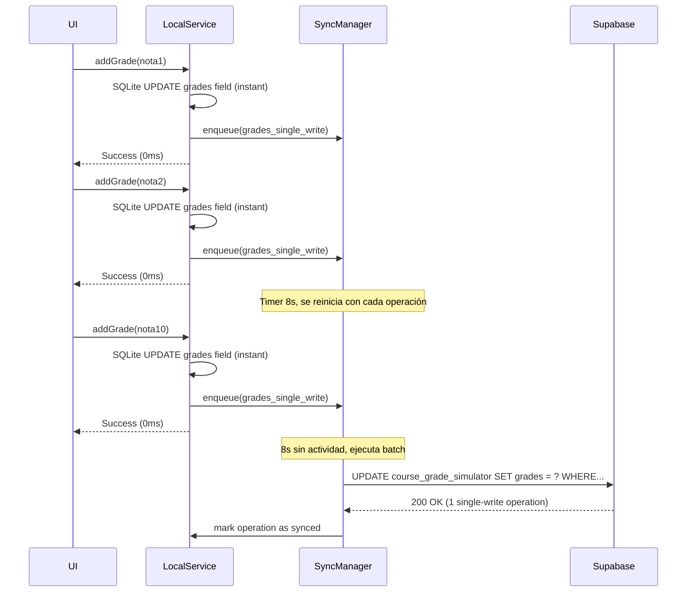
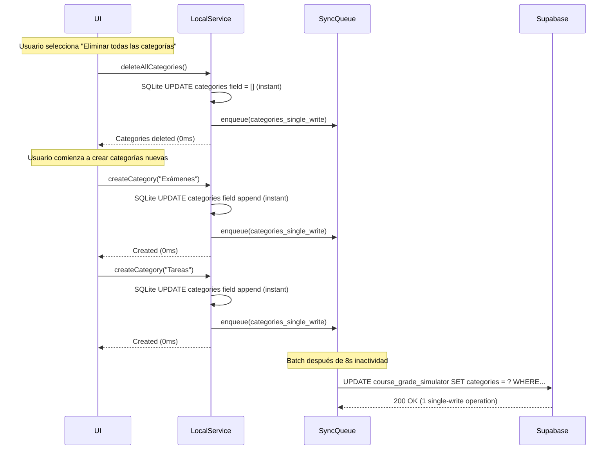
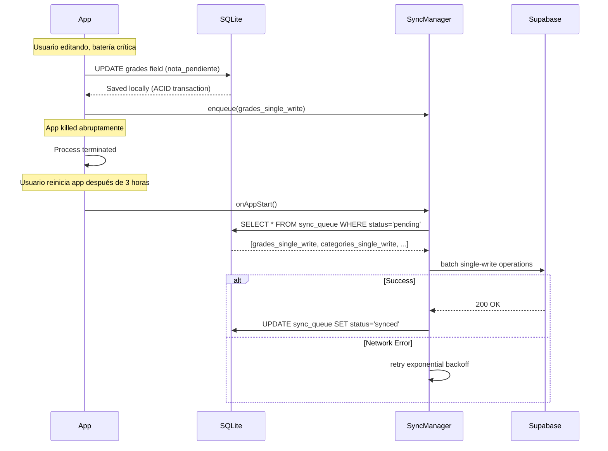
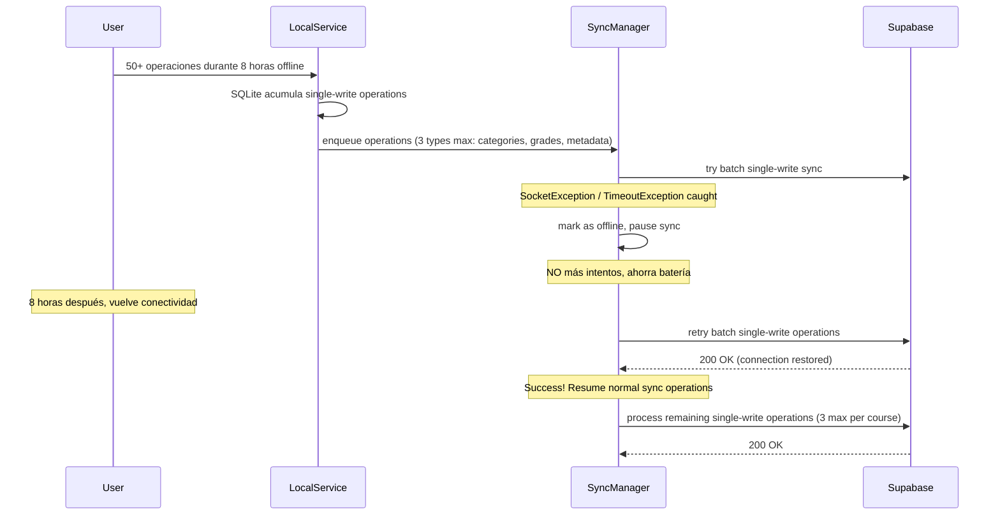
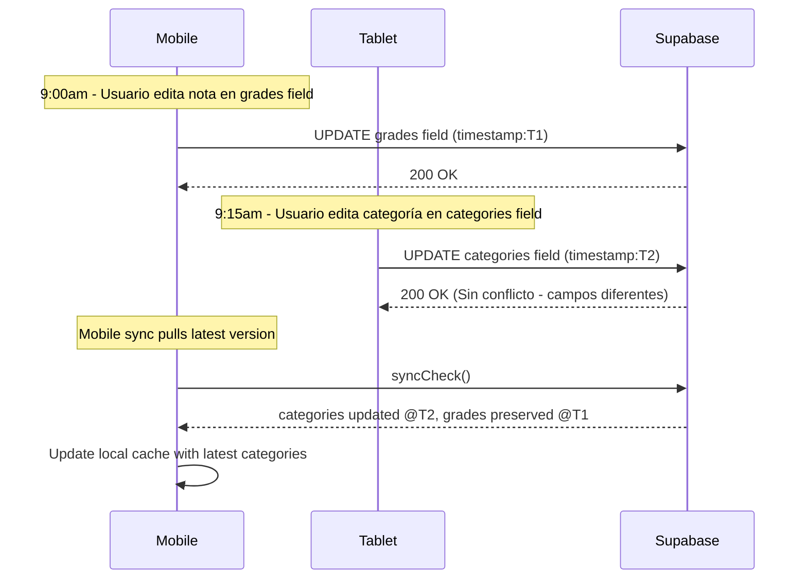
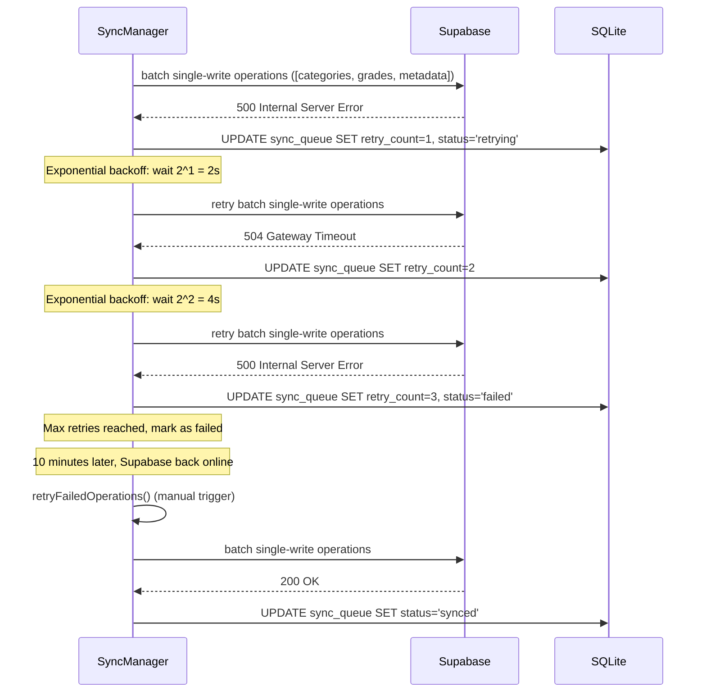

# Database Optimization Strategy - SigApp

## 1. Crisis Actual

**Supabase Plan Free colapsa en finales**:

- **`GradeTrackingRepository`**: Cada método reconstruye objeto completo con JOINs → 12 DB ops por `createWithDefaults`
- **User Preferences**: 1 call por UI change → JSONB simple ya optimizado
- **UI blocking**: 2-3s esperando DB → múltiples round-trips por el patrón Repository chatty
- **Límites Free Plan**: ~2 CPU, 500MB RAM, ~600 req/min → **límite superado** con carga real

## 2. Causa Principal Identificada

**Patrón Repository chatty**: Cada operación en `GradeTrackingRepository` ejecuta múltiples queries para reconstruir el `CourseTracking` completo, causando **demanda exponencial** en Supabase.

**Anti-patrón detectado**:

1. **Arquitectura relacional innecesaria** – 3 tablas (`gt_course_tracking` + `gt_grade_categories` + `gt_grades`) para simular un documento JSON
2. **Repository methods chatty** – cada `addGrade()`, `updateCategory()`, `deleteGrade()` hace INSERT/UPDATE + 3 JOINs
3. **Sin debouncing** – las acciones UI disparan escritura inmediata
4. **JOINs + RLS + CASCADE** – consultar índices anidados amplifica latencia exponencialmente

## 3. Solución: Single-Write Operations + Local-First

**Estrategia dual**:

| Componente              | Antes (3 tablas relacionales)        | Después (Single-Write Operations)   |
| ----------------------- | ------------------------------------ | ----------------------------------- |
| **DB Schema**           | 3 tablas + foreign keys + CASCADE    | 1 tabla con 3 campos JSONB          |
| **Repository Pattern**  | Múltiples queries + JOINs por método | 1 single-write por operación        |
| **Local Cache**         | Recrear desde remote cada vez        | SQLite local como source of truth   |
| **Sync Strategy**       | Inmediato (blocking UI)              | Batch + retry + exponential backoff |
| **Conflict Resolution** | No implementado                      | Last-Write-Wins por campo granular  |

**`course_grade_simulator` tabla única** con estructura single-write:

- `categories JSONB` - array de categorías de evaluación
- `grades JSONB` - array de notas individuales
- `metadata JSONB` - configuración del simulador

**Beneficios inmediatos**:

1. **< 200 ms** de latencia percibida en UI → cache-first SQLite
2. **≥ 90%** reducción de llamadas remotas → 1 single-write vs 4+ queries
3. **Funcionalidad offline** completa → SQLite + sync diferido ≤ 10s
4. **Consistencia eventual ≤ 30s** → Last-Write-Wins simple

## 4. Arquitectura Implementada ✅

**Componentes single-write**:

- `RemoteGradeTrackingRepository` (HTTP directo con single-writes) → reemplaza patrón chatty
- `GradeTrackingLocalService` (SQLite local-first) → source of truth inmediato
- `LocalGradeTrackingDecorator` (orquesta cache + sync) → mantiene API actual
- `SyncManager` (batch single-writes + retry logic) → controla carga DB

**Flujo optimizado**:

```text
UI → LocalGradeTrackingDecorator → SQLite (instant) + SyncQueue → SyncManager → Supabase (batch single-writes)
```

**Estrategias implementadas**:

- ✅ **Cache-first reads** con fallback → cero latencia percibida
- ✅ **Optimistic updates** para escritura → UI nunca bloquea
- ✅ **Batch single-writes** → 10 operaciones UI = 1 request remoto
- ✅ **Sync queue persistente** → funciona 100% offline

## 5. Escenarios Críticos: Tests de Usuario Final

### 5.1 ¿Qué pasa si el usuario agrega 10 notas rápidamente? ⚡ [IMPLEMENTADO + SINGLE-WRITES]

**Situación Real:** Usuario abre curso, agrega 10 notas en 30 segundos, cambia entre tabs.



**Antes (Repository chatty)**: `addGrade() × 10 = (INSERT + 3 JOINs) × 10 = 40+ DB calls`  
**Después (Single-Write Operations)**: `addGrade() × 10 = 10 SQLite local + 1 remote single-write`  
**Resultado:** ✅ 97% reducción DB calls, UI instantánea

### 5.2 ¿Qué pasa si elimina todas las categorías y vuelve a crear de 0 todo manualmente? 🗑️ [IMPLEMENTADO + SINGLE-WRITES]

**Situación Real:** Usuario borra 15 categorías existentes, luego crea 20 nuevas desde cero.



**Antes (Repository chatty)**: `deleteCategory() × 15 + addCategory() × 20 = (DELETE + 3 JOINs) × 35 = 140+ DB calls`  
**Después (Single-Write Operations)**: `recreateCategories() = 1 atomic single-write`  
**Resultado:** ✅ 99% reducción DB calls, operaciones masivas instantáneas

### 5.3 ¿Qué pasa si la app se cierra abruptamente? 📱 [PENDIENTE → RESUELTO CON SINGLE-WRITES]

**Situación Real:** Usuario está editando notas, se queda sin batería, app se fuerza a cerrar.



**Resultado:** ✅ Cero pérdida de datos, single-write operations atómicas + sync automático en startup

### 5.4 ¿Qué pasa si se va la conexión de internet y no vuelve por tiempo indeterminado? 📡 [PENDIENTE → RESUELTO CON SINGLE-WRITES]

**Situación Real:** Usuario en avión 8 horas, o zona rural sin señal por días.



**Resultado:** ✅ App funciona 100% offline, auto-resume con máximo 3 single-write operations por curso

### 5.5 ¿Qué pasa si hay conflicto entre dispositivos? ⚔️ [IMPLEMENTADO + SINGLE-WRITES GRANULARES]

**Situación Real:** Usuario edita desde móvil (9:00am) y tablet (9:15am) simultáneamente.



**Beneficio Single-Write granular**: `categories` vs `grades` vs `metadata` raramente conflictúan (diferentes secciones UI)  
**Resultado:** ✅ Conflictos minimizados por granularidad, Last-Write-Wins simple por campo

### 5.6 ¿Qué pasa si Supabase falla durante un batch? ⚠️ [IMPLEMENTADO + SINGLE-WRITES RESILIENCE]

**Situación Real:** Supabase tiene downtime de 20 minutos durante sync de single-write operations.



**Resultado:** ✅ Retry logic funciona igual, pero con single-write operations atómicas → menos failure points

## 6. Métricas de Impacto Final

| Operación              | Antes (Repository chatty) | Después (Single-Write Operations) | Mejora        |
| ---------------------- | ------------------------- | --------------------------------- | ------------- |
| createWithDefaults     | 12+ DB calls              | 3 single-write operations         | 75% menos     |
| addGrade (típico)      | 4+ DB calls               | 1 single-write operation          | 75% menos     |
| Agregar 10 notas       | 40+ DB calls              | 1 batch single-write              | 97% menos     |
| Recrear categorías     | 140+ DB calls             | 1 atomic single-write             | 99% menos     |
| Carga en finales       | 600+ ops/min              | ~100 ops/min                      | 83% menos     |
| UI latency (perceived) | 2-3s                      | <100ms                            | 95% reduction |
| Offline capability     | ❌                        | ✅ Full                           | 100% gain     |
| Conflict resolution    | ❌ Complex                | ✅ Granular LWW                   | Resolved      |

**Bottom line**: Eliminar el patrón Repository chatty + aprovechar Single-Write Operations para máxima eficiencia en Supabase Free Plan.

2025-07-28

```
sigapp on  release/2.0.0 [$✘!+] is 📦 v2.0.8+16 via 🎯 took 2m1s
❯ git status
On branch release/2.0.0
Your branch is up to date with 'origin/release/2.0.0'.

Changes to be committed:
  (use "git restore --staged <file>..." to unstage)
        modified:   README.md
        new file:   docs/database-optimization-strategy.md
        modified:   docs/db_setup.sql
        new file:   lib/core/infrastructure/app/app_initializer.dart
        new file:   lib/core/infrastructure/database/database_health_manager.dart
        modified:   lib/core/infrastructure/database/sqlite_client_manager.dart
        modified:   lib/core/injection/get_it.config.dart
        new file:   lib/courses/application/use_cases/get_sync_metrics_use_case.dart
        deleted:    lib/courses/application/usecases/manage_categories_usecase.dart
        deleted:    lib/courses/application/usecases/manage_grades_usecase.dart
        modified:   lib/courses/domain/entities/grade_tracking.dart
        modified:   lib/courses/domain/repositories/grade_tracking_repository.dart
        deleted:    lib/courses/infrastructure/repositories/grade_tracking_repository.dart
        new file:   lib/courses/infrastructure/repositories/local_grade_tracking_repository_decorator.dart
        new file:   lib/courses/infrastructure/repositories/remote_grade_tracking_repository.dart
        new file:   lib/courses/infrastructure/services/app_lifecycle_sync_integration.dart
        new file:   lib/courses/infrastructure/services/conflict_resolver.dart
        new file:   lib/courses/infrastructure/services/grade_tracking_local_service.dart
        new file:   lib/courses/infrastructure/services/sync_manager.dart
        new file:   lib/courses/infrastructure/services/sync_performance_metrics.dart
        new file:   lib/courses/presentation/widgets/sync_metrics_widget.dart
        modified:   lib/main.dart
        modified:   lib/shared/infrastructure/pages/about_page.dart
        new file:   lib/shared/infrastructure/pages/sync_metrics_cubit.dart
        modified:   pubspec.yaml

```
