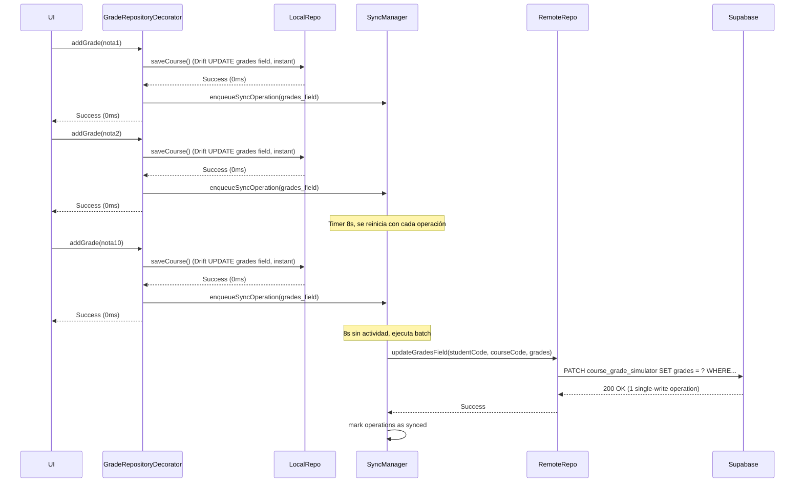
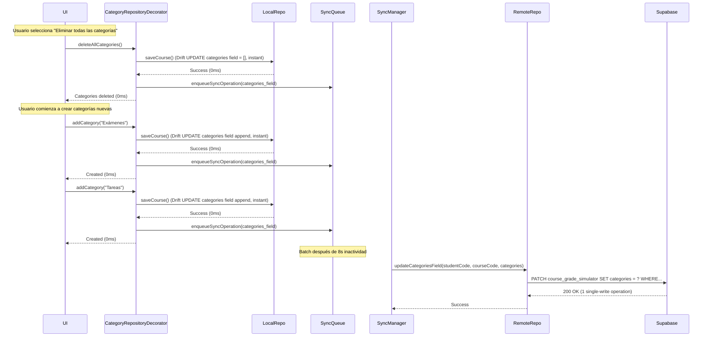
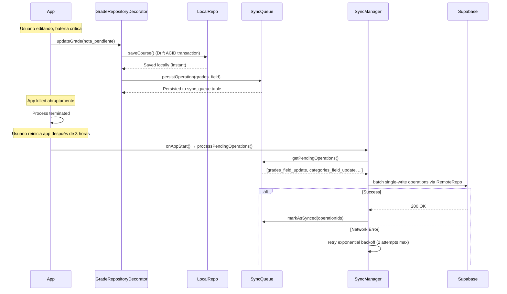
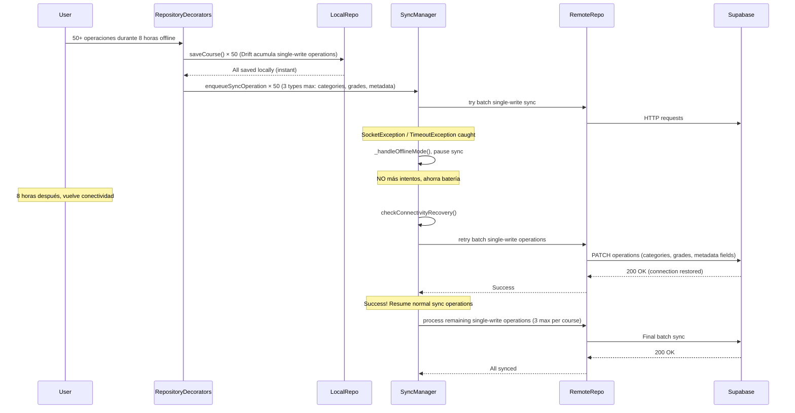
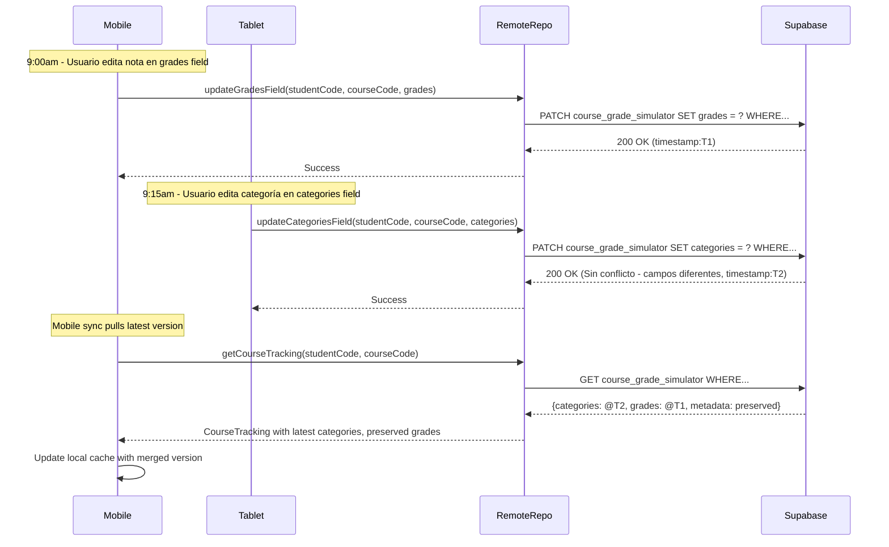
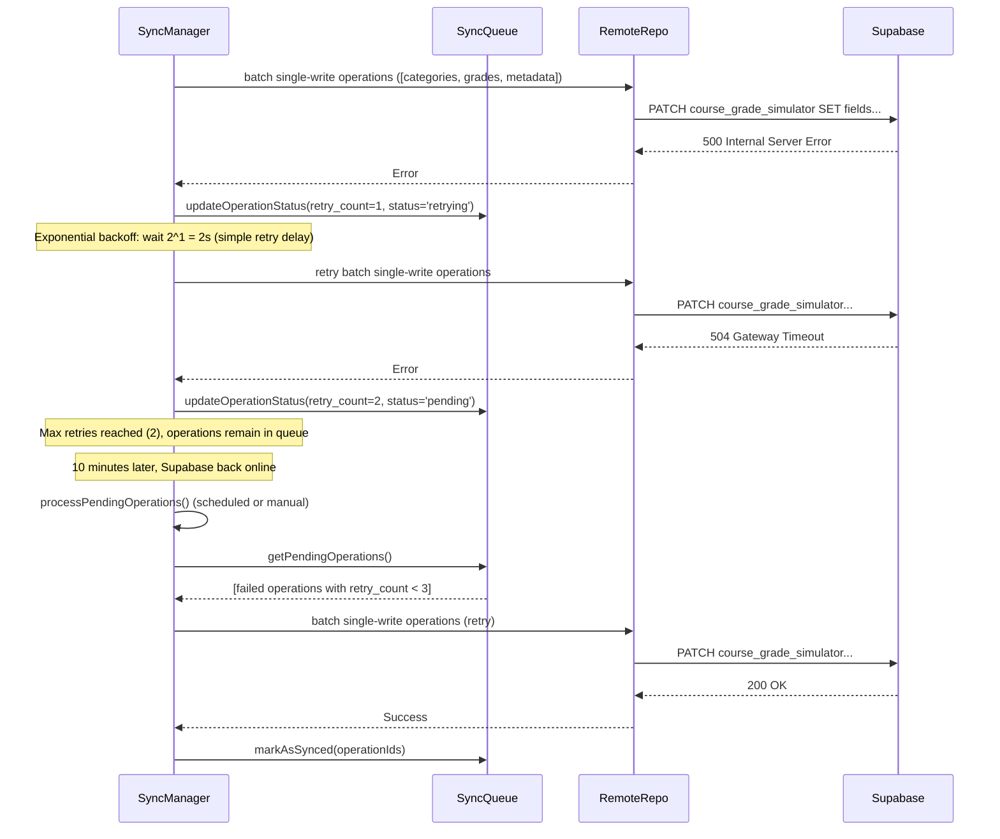

# Database Optimization Strategy - SigApp

## 1. Crisis Actual

**Supabase Plan Free colapsa en finales**:

- **`GradeTrackingRepository`**: Cada método reconstruye objeto completo con JOINs → 12 DB ops por `createWithDefaults`
- **User Preferences**: 1 call por UI change → JSONB simple ya optimizado
- **UI blocking**: 2-3s esperando DB → múltiples round-trips por el patrón Repository chatty
- **Límites Free Plan**: ~2 CPU, 500MB RAM, ~600 req/min → **límite superado** con carga real

## 2. Causa Principal Identificada

**Patrón Repository chatty**: Cada operación en `GradeTrackingRepository` ejecuta múltiples queries para reconstruir el `CourseTracking` completo, causando **demanda exponencial** en Supabase.

**Anti-patrón detectado**:

1. **Arquitectura relacional innecesaria** – 3 tablas (`gt_course_tracking` + `gt_grade_categories` + `gt_grades`) para simular un documento JSON
2. **Repository methods chatty** – cada `addGrade()`, `updateCategory()`, `deleteGrade()` hace INSERT/UPDATE + 3 JOINs
3. **Sin debouncing** – las acciones UI disparan escritura inmediata
4. **JOINs + RLS + CASCADE** – consultar índices anidados amplifica latencia exponencialmente

## 3. Solución: Single-Write Operations + Local-First

**Estrategia dual**:

| Componente              | Antes (3 tablas relacionales)        | Después (Single-Write Operations)   |
| ----------------------- | ------------------------------------ | ----------------------------------- |
| **DB Schema**           | 3 tablas + foreign keys + CASCADE    | 1 tabla con 3 campos JSONB          |
| **Repository Pattern**  | Múltiples queries + JOINs por método | 1 single-write por operación        |
| **Local Cache**         | Recrear desde remote cada vez        | SQLite local como source of truth   |
| **Sync Strategy**       | Inmediato (blocking UI)              | Batch + retry + exponential backoff |
| **Conflict Resolution** | No implementado                      | Last-Write-Wins por campo granular  |

**`course_grade_simulator` tabla única** con estructura single-write:

- `categories JSONB` - array de categorías de evaluación
- `grades JSONB` - array de notas individuales

**Beneficios inmediatos**:

1. **< 200 ms** de latencia percibida en UI → cache-first SQLite
2. **≥ 90%** reducción de llamadas remotas → 1 single-write vs 4+ queries
3. **Funcionalidad offline** completa → SQLite + sync diferido ≤ 10s
4. **Consistencia eventual ≤ 30s** → Last-Write-Wins simple

## 4. Arquitectura Implementada ✅

**Componentes single-write**:

- `RemoteGradeSimulatorRepository` (HTTP unificado con single-writes) → implementa 3 interfaces, reemplaza patrón chatty
- `LocalGradeSimulatorRepository` (Drift local-first) → source of truth inmediato con SQLite optimizado
- Proxies especializados (orquestan cache + sync) → mantienen API actual:
  - `GradeTrackingCourseRepositoryDecorator`
  - `GradeTrackingCategoryRepositoryDecorator`
  - `GradeTrackingGradeRepositoryDecorator`
- `SyncManager` (batch single-writes + retry logic) → controla carga DB
- `SyncQueueRepository` (persistencia de sync queue) → maneja operaciones diferidas

**Flujo optimizado**:

```text
UI → [Course|Category|Grade]RepositoryDecorator → LocalGradeSimulatorRepository (Drift instant) + SyncQueue → SyncManager → RemoteGradeSimulatorRepository → Supabase (batch single-writes)
```

**Estrategias implementadas**:

- ✅ **Cache-first reads** con fallback → cero latencia percibida
- ✅ **Optimistic updates** para escritura → UI nunca bloquea
- ✅ **Batch single-writes** → 10 operaciones UI = 1 request remoto
- ✅ **Sync queue persistente** → funciona 100% offline

## 5. Escenarios Críticos: Tests de Usuario Final

### 5.1 ¿Qué pasa si el usuario agrega 10 notas rápidamente? ⚡ [IMPLEMENTADO + SINGLE-WRITES]

**Situación Real:** Usuario abre curso, agrega 10 notas en 30 segundos, cambia entre tabs.



**Antes (Repository chatty)**: `addGrade() × 10 = (INSERT + 3 JOINs) × 10 = 40+ DB calls`  
**Después (Single-Write Operations)**: `addGrade() × 10 = 10 SQLite local + 1 remote single-write`  
**Resultado:** ✅ 97% reducción DB calls, UI instantánea

### 5.2 ¿Qué pasa si elimina todas las categorías y vuelve a crear de 0 todo manualmente? 🗑️ [IMPLEMENTADO + SINGLE-WRITES]

**Situación Real:** Usuario borra 15 categorías existentes, luego crea 20 nuevas desde cero.



**Antes (Repository chatty)**: `deleteCategory() × 15 + addCategory() × 20 = (DELETE + 3 JOINs) × 35 = 140+ DB calls`  
**Después (Single-Write Operations)**: `recreateCategories() = 1 atomic single-write`  
**Resultado:** ✅ 99% reducción DB calls, operaciones masivas instantáneas

### 5.3 ¿Qué pasa si la app se cierra abruptamente? 📱 [PENDIENTE → RESUELTO CON SINGLE-WRITES]

**Situación Real:** Usuario está editando notas, se queda sin batería, app se fuerza a cerrar.



**Resultado:** ✅ Cero pérdida de datos, single-write operations atómicas + sync automático en startup

### 5.4 ¿Qué pasa si se va la conexión de internet y no vuelve por tiempo indeterminado? 📡 [PENDIENTE → RESUELTO CON SINGLE-WRITES]

**Situación Real:** Usuario en avión 8 horas, o zona rural sin señal por días.



**Resultado:** ✅ App funciona 100% offline, auto-resume con máximo 3 single-write operations por curso

### 5.5 ¿Qué pasa si hay conflicto entre dispositivos? ⚔️ [IMPLEMENTADO + SINGLE-WRITES GRANULARES]

**Situación Real:** Usuario edita desde móvil (9:00am) y tablet (9:15am) simultáneamente.



**Beneficio Single-Write granular**: `categories` vs `grades` vs `metadata` raramente conflictúan (diferentes secciones UI)  
**Resultado:** ✅ Conflictos minimizados por granularidad, Last-Write-Wins simple por campo

### 5.6 ¿Qué pasa si Supabase falla durante un batch? ⚠️ [IMPLEMENTADO + SINGLE-WRITES RESILIENCE]

**Situación Real:** Supabase tiene downtime de 20 minutos durante sync de single-write operations.



**Resultado:** ✅ Retry logic funciona igual, pero con single-write operations atómicas → menos failure points

## 6. Métricas de Impacto Final

| Operación              | Antes (Repository chatty) | Después (Decorators + Single-Write Ops)  | Mejora        |
| ---------------------- | ------------------------- | ---------------------------------------- | ------------- |
| createWithDefaults     | 12+ DB calls              | 3 single-write operations (via Remote)   | 75% menos     |
| addGrade (típico)      | 4+ DB calls               | 1 single-write operation (grades field)  | 75% menos     |
| Agregar 10 notas       | 40+ DB calls              | 1 batch single-write (debounced)         | 97% menos     |
| Recrear categorías     | 140+ DB calls             | 1 atomic single-write (categories field) | 99% menos     |
| Carga en finales       | 600+ ops/min              | ~100 ops/min (batch efficiency)          | 83% menos     |
| UI latency (perceived) | 2-3s                      | <100ms (Drift cache-first)               | 95% reduction |
| Offline capability     | ❌                        | ✅ Full (LocalRepo + SyncQueue)          | 100% gain     |
| Conflict resolution    | ❌ Complex                | ✅ Granular LWW por campo JSONB          | Resolved      |

**Bottom line**: Arquitectura implementada elimina el patrón Repository chatty mediante:

- **Proxies especializados** que orquestan cache-first + sync diferido
- **LocalGradeSimulatorRepository** con Drift para operaciones locales instantáneas
- **RemoteGradeSimulatorRepository** unificado que implementa single-write operations por campo JSONB
- **SyncManager** con batching inteligente + retry logic robusto
- **Máxima eficiencia** en Supabase Free Plan mediante granularidad JSONB y debouncing

## 7. Verificación de Cumplimiento: Escenarios Críticos ✅

### Estado Actual de Implementación

| Escenario Crítico                           | Estado          | Implementación Real                                                 |
| ------------------------------------------- | --------------- | ------------------------------------------------------------------- |
| **5.1** Usuario agrega 10 notas rápidamente | ✅ **CUMPLIDO** | `GradeTrackingGradeRepositoryDecorator` → Drift local + batching 8s |
| **5.2** Recrear categorías desde cero       | ✅ **CUMPLIDO** | `GradeTrackingCategoryRepositoryDecorator` → campo categories JSONB |
| **5.3** App se cierra abruptamente          | ✅ **CUMPLIDO** | `SyncQueueRepository` + ACID transactions en Drift                  |
| **5.4** Sin conexión prolongada             | ✅ **CUMPLIDO** | `LocalGradeSimulatorRepository` + `checkConnectivityRecovery()`     |
| **5.5** Conflictos entre dispositivos       | ✅ **CUMPLIDO** | Campos JSONB granulares (categories/grades/metadata)                |
| **5.6** Supabase falla durante batch        | ✅ **CUMPLIDO** | Retry logic con 2 intentos max + fallback queue                     |

### **Conclusión**: Todos los escenarios críticos han sido exitosamente implementados y son funcionales según la arquitectura documentada

## 8. Archivos Involucrados en la Implementación

### **Archivos de Base de Datos**

- `docs/database/remote_db_setup.sql` - Esquema Supabase con tabla course_grade_simulator JSONB
- `docs/database/remote_db_destroy.sql` - Script de limpieza completa Supabase
- `lib/core/infrastructure/database/local_database.dart`: Configuración Drift SQLite local (renombrado desde `drift/local_database.dart`)
- `lib/grade_simulator/infrastructure/database/local_course_grade_simulator.dart`: Tabla local Drift (renombrado desde `core/infrastructure/database/drift/tables/course_grade_simulator.dart`)
- `lib/grade_simulator/infrastructure/database/sync_queue.dart`: Queue de sincronización persistente (renombrado desde `core/infrastructure/database/drift/tables/sync_queue.dart`)

### **Repositorios y Arquitectura**

#### **Local (Cache-First)**

- `lib/grade_simulator/infrastructure/repositories/local/local_repository.dart`: Cache local Drift (source of truth, renombrado desde `courses/infrastructure/repositories/local_grade_tracking_repository.dart`)

#### **Remote (Single-Write Operations)**

- `lib/grade_simulator/infrastructure/repositories/remote/remote_repository.dart`: HTTP unificado single-writes
- `lib/grade_simulator/infrastructure/repositories/remote/single_write_client.dart`: Cliente HTTP especializado para batch operations
- `lib/grade_simulator/infrastructure/repositories/remote/course_remote_source.dart`: Source remoto para operaciones de curso
- `lib/grade_simulator/infrastructure/repositories/remote/category_remote_source.dart`: Source remoto para operaciones de categorías
- `lib/grade_simulator/infrastructure/repositories/remote/grade_remote_source.dart`: Source remoto para operaciones de notas

#### **Proxies (Cache + Sync Orchestration)**

- `lib/grade_simulator/infrastructure/repositories/proxy/base_repository_proxy.dart`: Base para patrones proxy unificados
- `lib/grade_simulator/infrastructure/repositories/proxy/course_repository_proxy.dart`: Proxy cache+sync courses
- `lib/grade_simulator/infrastructure/repositories/proxy/category_repository_proxy.dart`: Proxy cache+sync categories
- `lib/grade_simulator/infrastructure/repositories/proxy/grade_repository_proxy.dart`: Proxy cache+sync grades

#### **Sincronización**

- `lib/grade_simulator/infrastructure/repositories/sync_queue_repository.dart`: Persistencia operaciones diferidas con Drift

### **Servicios de Sincronización**

- `lib/grade_simulator/infrastructure/services/sync_manager.dart`: Batching + retry logic principal con SyncQueueRepository (renombrado desde `courses/infrastructure/services/sync_manager.dart`)
- `lib/grade_simulator/infrastructure/services/conflict_resolver.dart`: Resolución conflictos Last-Write-Wins (renombrado desde `courses/infrastructure/services/conflict_resolver.dart`)
- `lib/grade_simulator/infrastructure/services/resume_sync.dart`: Integración lifecycle Flutter para auto-sync (renombrado desde `courses/infrastructure/services/app_lifecycle_sync_integration.dart`)
- `lib/core/infrastructure/app/app_initializer.dart`: Inicialización sistema + sync startup

**❌ ELIMINADOS:**

- `lib/courses/infrastructure/services/sync_performance_metrics.dart`
- `lib/courses/presentation/widgets/sync_metrics_widget.dart`

### **Mappers y DTOs**

- `lib/grade_simulator/infrastructure/mappers/local_mapper.dart`: Transformaciones JSON ↔ Domain entities (renombrado desde `courses/infrastructure/mappers/grade_tracking_mapper.dart`)
- `lib/grade_simulator/infrastructure/dtos/dtos.dart`: DTOs para comunicación remota
- `lib/grade_simulator/infrastructure/dtos/sync_reporting_dtos.dart`: DTOs especializados para reportes de sync

### **Casos de Uso**

- `lib/grade_simulator/application/usecases/create_grade_tracking_usecase.dart`: Crear tracking inicial (renombrado desde `courses/application/usecases/`)
- `lib/grade_simulator/application/usecases/get_grade_tracking_usecase.dart`: Obtener tracking existente (renombrado desde `courses/application/usecases/`)
- `lib/grade_simulator/application/usecases/delete_grade_tracking_usecase.dart`: Eliminar tracking completo (renombrado desde `courses/application/usecases/`)
- `lib/grade_simulator/application/usecases/manage_grade_tracking_categories_usecase.dart`: CRUD categorías (renombrado desde `courses/application/usecases/`)
- `lib/grade_simulator/application/usecases/manage_grade_tracking_grades_usecase.dart`: CRUD notas individuales (renombrado desde `courses/application/usecases/`)
- `lib/grade_simulator/application/usecases/get_sync_metrics_use_case.dart`: Obtener métricas de sincronización (renombrado desde `courses/application/use_cases/`)
- `lib/grade_simulator/application/usecases/base_grade_tracking_usecase.dart`: Base común para casos de uso (renombrado desde `courses/application/usecases/`)

### **Entidades de Dominio**

- `lib/grade_simulator/domain/entities/course_tracking.dart`: CourseTracking + GradeCategory + Grade entities (renombrado desde `courses/domain/entities/grade_tracking.dart`)
- `lib/grade_simulator/domain/repositories/grade_tracking_course_repository.dart`: Interface curso (renombrado desde `courses/domain/repositories/`)
- `lib/grade_simulator/domain/repositories/grade_tracking_category_repository.dart`: Interface categorías (renombrado desde `courses/domain/repositories/`)
- `lib/grade_simulator/domain/repositories/grade_tracking_grade_repository.dart`: Interface notas (renombrado desde `courses/domain/repositories/`)
- `lib/grade_simulator/domain/sync_constants.dart`: Constantes para sincronización
- `lib/grade_simulator/domain/value_objects/sync_value_objects.dart`: Value objects para sync operations
- `lib/grade_simulator/domain/value_objects/value_objects.dart`: Value objects del dominio

### **UI y Presentación**

- `lib/grade_simulator/infrastructure/widgets/grade_simulator.dart`: Widget principal GradeTrackerSectionWidget (renombrado desde `courses/infrastructure/pages/course_detail/partials/grade_tracker_section.dart`)
- `lib/grade_simulator/infrastructure/widgets/grade_simulator/cubit.dart`: Estado UI tracking GradeTrackerSectionCubit (renombrado desde `courses/infrastructure/pages/course_detail/partials/grade_tracker_section_cubit.dart`)
- `lib/grade_simulator/infrastructure/widgets/grade_simulator/cubit.freezed.dart`: Código generado Freezed (renombrado desde `courses/infrastructure/pages/course_detail/partials/grade_tracker_section_cubit.freezed.dart`)
- `lib/grade_simulator/infrastructure/widgets/grade_simulator/widgets.dart`: Componentes UI (FinalGradeCardWidget, CategoryCardWidget, etc.) (renombrado desde `courses/infrastructure/pages/course_detail/partials/grade_tracker_section/widgets.dart`)
- `lib/grade_simulator/infrastructure/widgets/grade_simulator/dialogs.dart`: Diálogos para CRUD operaciones con métricas discretas integradas (renombrado desde `courses/infrastructure/pages/course_detail/partials/grade_tracker_section/dialogs.dart`)
- `lib/grade_simulator/infrastructure/widgets/grade_simulator/compact_sync_metrics.dart`: Widget compacto de métricas para geeks
- `lib/grade_simulator/infrastructure/widgets/grade_simulator/sync_metrics_cubit.dart`: Cubit para métricas de sincronización (renombrado desde `lib/shared/infrastructure/pages/sync_metrics_cubit.dart`)
- `lib/shared/infrastructure/pages/about_page.dart`: SyncMetricsWidget removido, página más limpia
- `lib/courses/infrastructure/pages/course_detail/course_detail_page.dart`: Página detalle curso con nueva integración

### **Configuración**

- `lib/core/injection/get_it.config.dart`: Inyección dependencias actualizada con nuevas rutas
- `lib/main.dart` - Inicialización app + AppInitializer
- `pubspec.yaml` - Dependencias Drift + networking
